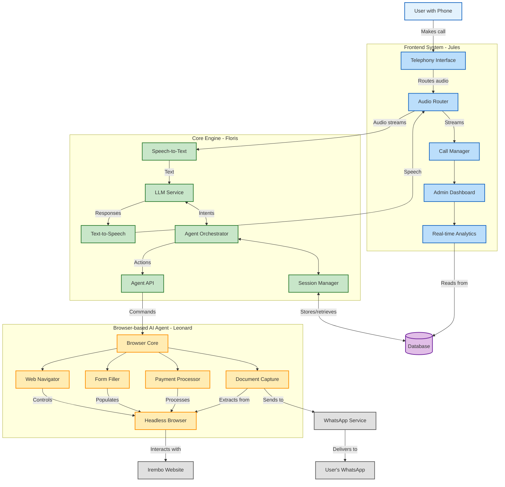

## Overview

The Irembo Voice AI Agent is structured around three main components that work together to enable phone-based access to government services.

## Components

### 1. Frontend System (Jules)

Handles all user interactions and provides administrative interfaces.

* *Telephony Interface*
  * Processes incoming and outgoing calls
  * Routes audio streams to/from the core engine
  * Uses Twilio or Africa's Talking API for call handling

* *Admin Web Portal*
  * Monitors active sessions
  * Provides system configuration
  * Manages service workflows

* *Real-time Dashboard*
  * Visualizes call volumes and success rates
  * Shows agent activities in real-time
  * Tracks key performance metrics

### 2. Core Engine (Floris)

Acts as the central intelligence, processing speech and coordinating actions.

* *LLM Service with TTS/STT*
  * Converts user speech to text
  * Processes natural language to determine intent
  * Generates responses as text
  * Converts text responses back to speech

* *Agent Orchestrator*
  * Plans the sequence of actions based on user intent
  * Maintains conversation context
  * Handles error recovery
  * Routes commands to the browser agent

* *Session Manager*
  * Maintains state between interactions
  * Handles user authentication
  * Tracks progress through multi-step processes
  * Manages data persistence

### 3. Browser-based AI Agent (Leonard)

Interacts with the Irembo website to execute user requests.

* *Web Navigation Module*
  * Automates browser interactions
  * Handles site navigation
  * Manages authentication with Irembo
  * Handles dynamic page elements

* *Form Filling Module*
  * Maps user information to form fields
  * Handles complex form validation
  * Adjusts for different service requirements
  * Captures errors and feedback

* *Payment Processing*
  * Integrates with payment workflows
  * Handles payment verification
  * Captures receipts and confirmations
  * Processes mobile money transactions

### 4. External Systems

* *Irembo Website*
  * Target platform that the browser agent interacts with
  * Source of government services and forms
  * Payment processing system

* *WhatsApp API*
  * Delivery channel for documents and confirmations
  * Secondary communication channel
  * Provides status updates and notifications

* *Database*
  * Stores user session information
  * Records transaction history
  * Logs system activities
  * Maintains configuration settings

## Data Flow

1. *Call Initiation*
   * User calls the system phone number
   * Telephony system answers and establishes a session
   * Audio stream is connected to the Core Engine

2. *Service Selection*
   * LLM processes user's spoken request
   * Intent is determined and service workflow is selected
   * Agent Orchestrator begins planning necessary steps

3. *Information Collection*
   * Core Engine engages in dialog to collect required information
   * Session Manager stores collected data
   * Validation is performed on user inputs

4. *Service Execution*
   * Browser Agent navigates to appropriate Irembo service
   * Form Filling Module completes necessary forms
   * Payment Processing handles any required payments

5. *Completion and Delivery*
   * Browser Agent captures confirmation and documents
   * Documents are delivered to user via WhatsApp
   * Call concludes with summary and next steps

## Team Responsibilities

The system architecture is designed to allow parallel development by our three-person team:

* *Jules*: Frontend System and External Integrations
* *Floris*: Core Engine and Dialog Management
* *Leonard*: Browser-based Agent and Web Automation
